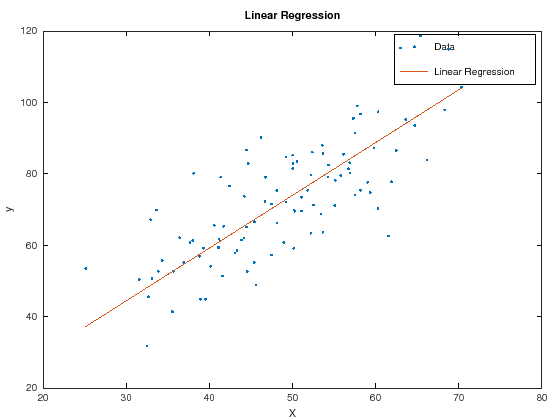

# Linear Regression - Gradient Descent - Octave
[Linear regression](http://en.wikipedia.org/wiki/Linear_regression) with One variable using [Gradient descent](http://en.wikipedia.org/wiki/Gradient_descent) in Octave

## Description
This project demonstrates how the gradient descent algorithm may be used to solve a linear regression problem.
 
 
A small dataset of student test scores and the amount of hours they studied is utilized. Intuitively, there must be a relationship between the scores and the hours studied. The more one studies, the better one's test scores should be. The linear regression is used to uncover this relationship.
 
 
There are several numerical optimization techniques amongst which the Gradient Descent method is examined to minimize the cost function of Linear Regression.

## Usage
Run the jupyter notebook `linear_regression.ipynb`

## Results

